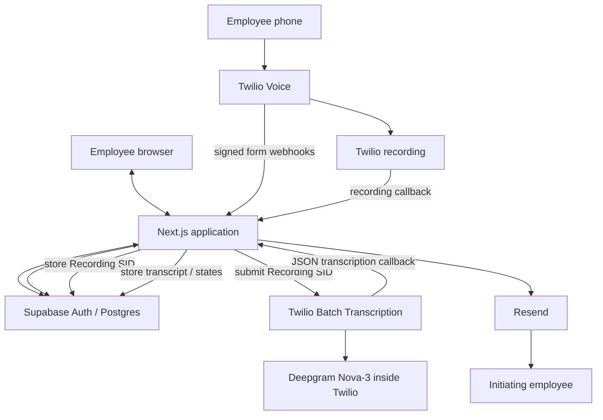

# Bat Phone Architecture

## 1. System overview

Bat Phone is an internal employee calling tool. A signed-in employee manages contacts in the browser, calls into a Twilio number from their own phone, speaks or keys in the contact they want, and is bridged to that destination. Bat Phone stores the call record in Supabase, proxies recording playback back to the authenticated owner, submits completed recordings to Twilio Batch Transcription, and emails the initiating employee a transcript or fallback notification when post-call processing finishes.

## 2. Technology choices

- Next.js 16 App Router, React 19, and TypeScript power both the browser UI and the server-side integration code. The current codebase keeps pages, Server Actions, and webhook handlers in one application.
- Supabase Auth and Postgres handle employee identity, session management, and application data. RLS is enabled on the application tables so browser-originated reads and writes stay owner-scoped.
- Twilio Programmable Voice owns the phone number, TwiML execution, call bridging, and webhook delivery.
- Twilio Batch Transcription handles asynchronous recording transcription. Bat Phone submits Twilio `RecordingSid` values to Twilio and receives a later JSON callback when the job completes or fails.
- Resend sends the post-call transcript or fallback email to the initiating employee.
- Vercel hosts the production deployment, and GitHub Codespaces is configured as the reproducible cloud development environment documented in the repo.

## 3. Architecture diagram

## 4. User / browser flow

The browser experience starts in `src/app/account/page.tsx`. Unauthenticated users land on the account screen and begin Google sign-in through Supabase Auth. The OAuth callback is handled in `src/app/auth/callback/route.ts`, which exchanges the code for a Supabase session, restricts any `next` return path to safe internal routes, and then sends the user either to onboarding or to the main application.

Onboarding in `src/app/onboarding/page.tsx` and `src/app/onboarding/actions.ts` captures the employee's own calling number in `public.profiles.phone_number`. That number is later used to identify the caller when Twilio hits the voice webhook.

After sign-in and onboarding, the main browser destinations are:

- `/contacts`: contact CRUD UI backed by authenticated Server Actions in `src/app/contacts/actions.ts`
- `/calls`: call history for the current user
- `/calls/[id]`: call detail view, including recording playback and transcript state
- `/account`: signed-in profile view, email display, and calling-number maintenance

The pages themselves are Server Components. They read the current Supabase session from the cookie-backed server client, rely on RLS plus explicit owner filters for user data, and hand interactive form behavior to client components where needed.

## 5. Voice call flow

The voice path starts when an employee calls the configured Twilio number.

1. Twilio sends a signed form POST to `/api/twilio/incoming`.
2. Bat Phone validates `X-Twilio-Signature` against the exact externally visible request URL, including proxy-forwarded host/protocol when present.
3. `incomingCallTwiml()` looks up the caller's `public.profiles.phone_number` and rejects unknown numbers.
4. If the caller is known and has contacts, Bat Phone returns a `<Gather>` prompt that accepts both speech and a single DTMF digit.
5. Twilio posts the gather result to `/api/twilio/resolve-contact`.
6. `resolveContactTwiml()` deterministically resolves the contact:
   - exact name match first
   - then case-insensitive name match
   - then constrained fuzzy matching
   - or DTMF `1` through `9` for the first contacts in the menu
7. On a match, Bat Phone creates the `calls` row before dialing and uses `twilio_call_sid` as the idempotency key so retried callbacks do not create duplicate calls.
8. Bat Phone returns `<Dial>` with `answerOnBridge`, the configured Bat Phone caller ID, dual-channel recording, `/api/twilio/dial-complete` as the dial action callback, and `/api/twilio/recording` as the recording status callback.
9. Twilio bridges the employee to the matched destination.
10. When the dial leg ends, Twilio posts `DialCallStatus` and duration to `/api/twilio/dial-complete`, which updates the stored status.

Error handling is intentionally simple and voice-safe: invalid signatures return `403`, malformed payloads return `400`, and unexpected repository or provider failures fall back to a generic TwiML message rather than exposing internal details to the caller.

## 6. Post-call pipeline

Once Twilio finishes the call recording, Bat Phone transitions into the asynchronous post-call path.

1. Twilio sends a signed form POST to `/api/twilio/recording`.
2. Bat Phone validates the signature, accepts only `RecordingStatus=completed`, and persists the `RecordingSid`, Twilio recording URL, and final recording duration to the `calls` row keyed by `twilio_call_sid`.
3. Bat Phone finds the same call again by `recording_sid`.
4. `submitRecordingForTranscription()` atomically claims transcription work by updating only rows whose `transcription_id` and `transcription_status` are still null.
5. Bat Phone submits the `RecordingSid` to Twilio Batch Transcription using the configured `TWILIO_TRANSCRIPTION_CONFIGURATION_ID`.
6. Twilio later POSTs an asynchronous JSON callback to `/api/twilio/transcription`.
7. Bat Phone validates both the Twilio signature and the unmodified raw JSON body. That validation depends on Twilio's `bodySHA256` request format, so the handler validates the raw body before parsing JSON.
8. The callback payload's `sourceId` is the original `recording_sid`, which Bat Phone uses to correlate the transcription result back to the call.
9. On success, Bat Phone converts Twilio's sentence list into a readable transcript and stores it in Supabase. On failure or unusable sentence data, the call is marked as transcription failed.
10. Bat Phone atomically claims email delivery, resolves the initiating employee's email, sends the transcript or fallback message through Resend, and links the email back to `/calls/[id]`.

Deepgram is not called directly by this application. The only transcription API call Bat Phone makes is the Twilio Batch Transcription job submission.

## 7. Data model

The current application data model centers on four tables:

- `auth.users`: Supabase-managed authentication users
- `public.profiles`: one row per authenticated user
- `public.contacts`: owner-scoped contacts that can be dialed
- `public.calls`: owner-scoped call history, recording metadata, transcription state, and email state

Important model relationships and fields:

- `public.profiles.id` equals `auth.users.id`. A trigger inserts the profile row when a new auth user is created.
- `public.profiles.phone_number` stores the employee's own calling number in `+1XXXXXXXXXX` format. The Twilio voice flow uses this field to identify which employee is calling in.
- Caller phone uniqueness is relied on operationally for routing: the voice flow assumes an inbound `From` number maps to one profile.
- `public.contacts.user_id` and `public.calls.user_id` define ownership. Browser-side queries pair RLS with explicit `.eq("user_id", user.id)` filters.
- `public.calls.contact_id` can be nulled if a contact is later deleted, so `contact_name_snapshot` preserves the historical name that was actually dialed.
- `public.calls.twilio_call_sid` is unique and is the idempotency anchor for the voice call record.
- `public.calls.recording_sid` uniquely correlates Twilio's recording callback and transcription callback back to the stored call.
- `public.calls.transcription_id` stores the Twilio Batch Transcription job ID.
- `public.calls.transcription_status`, `transcription_attempts`, `email_status`, `email_attempts`, and `email_sent_at` track post-call processing state and retries.

## 8. Security boundaries

### Browser / user trust boundary

- Employees authenticate through Google OAuth via Supabase Auth.
- The browser uses Supabase's publishable key and the authenticated session cookie, not the service-role key.
- RLS is enabled on `profiles`, `contacts`, and `calls`, and browser-originated queries stay owner-scoped.
- Contact and profile mutations use authenticated Next.js Server Actions rather than exposing a public CRUD API.
- OAuth return paths are restricted to safe internal paths so the sign-in flow cannot be turned into an open redirect.
- Missing and non-owned calls intentionally produce the same not-found behavior.

### Twilio webhook trust boundary

- Every Twilio form callback validates `X-Twilio-Signature`.
- Validation uses the externally visible URL because deployed requests may arrive through forwarded host/protocol headers.
- The transcription callback validates the raw JSON body, not a parsed object, because Twilio signs the exact body content.
- Invalid signatures are rejected before repository work begins.

### Server-only credential boundary

- `SUPABASE_SECRET_KEY`, `TWILIO_AUTH_TOKEN`, `TWILIO_ACCOUNT_SID`, and `RESEND_API_KEY` are server-only.
- Twilio callback handlers and recording fetches use the Supabase service-role client because Twilio is not acting as a signed-in browser user and still needs trusted database access.
- The browser never receives raw Twilio credentials, recording URLs, or Twilio media endpoints directly.
- Recording playback is proxied through `/api/calls/[callId]/recording` after authentication and ownership checks.

## 9. Reliability / idempotency

- Call rows are created before dialing so later dial-complete and recording callbacks have a durable record to update.
- `twilio_call_sid` is unique, and `createCallBeforeDial()` uses an idempotent insert/read pattern so duplicate delivery does not create duplicate call records.
- `recording_sid` is unique and is the correlation point for recording and transcription callbacks.
- `claimTranscription()` is atomic: only an unclaimed call can transition from null transcription state to `pending`.
- `claimEmail()` is atomic: only an unsent call can transition from null email state to `pending`.
- Both transcription submission and email delivery attempt a bounded retry loop before ending in a failed state.
- Duplicate callbacks are tolerated by checking the stored state before resubmitting work or re-sending email.
- Provider failures degrade to stored failed states plus fallback email behavior, rather than crashing the user-facing browser paths.

## 10. API / integration surface

| Method | Route | Purpose | Caller / auth |
| --- | --- | --- | --- |
| `POST` | `/api/twilio/incoming` | Start the TwiML voice flow for an inbound call | Twilio form webhook with `X-Twilio-Signature` |
| `POST` | `/api/twilio/resolve-contact` | Resolve speech or DTMF input to a contact and return `<Dial>` or retry/hangup TwiML | Twilio form webhook with `X-Twilio-Signature` |
| `POST` | `/api/twilio/dial-complete` | Persist the final dial outcome and duration | Twilio form webhook with `X-Twilio-Signature` |
| `POST` | `/api/twilio/recording` | Persist recording metadata and trigger transcription submission | Twilio form webhook with `X-Twilio-Signature` |
| `POST` | `/api/twilio/transcription` | Validate the raw JSON callback, correlate `sourceId`, store transcript state, and send email | Twilio JSON webhook with signature and raw-body validation |
| `GET` | `/api/calls/[callId]/recording` | Proxy the call recording back to the authenticated owner | Signed-in browser user, Supabase session, owner check |

Contact and profile mutations are not exposed as REST endpoints. They currently live in authenticated Next.js Server Actions under `src/app/contacts/actions.ts` and `src/app/onboarding/actions.ts`.

An OpenAPI contract is not necessary yet because these routes are currently consumed only by Twilio and the first-party Bat Phone UI. It would become more valuable if independent services or third-party clients started consuming the same APIs.

## 11. Important tradeoffs / POC boundaries

- The current implementation keeps UI, server actions, and provider callbacks in one Next.js application instead of splitting into separate frontend and backend services.
- Contact matching is deterministic and rules-based, not LLM-driven.
- Transcription is asynchronous batch processing after the call, not realtime captioning during the call.
- Recording playback uses the browser's native audio controls rather than a custom waveform or media player.
- The call history UI reflects the current persisted state and is refreshed by page navigation / rendering, not by websockets or background live updates.
- There is no separate queue or worker tier yet; the webhook handlers perform the bounded retry logic directly.
