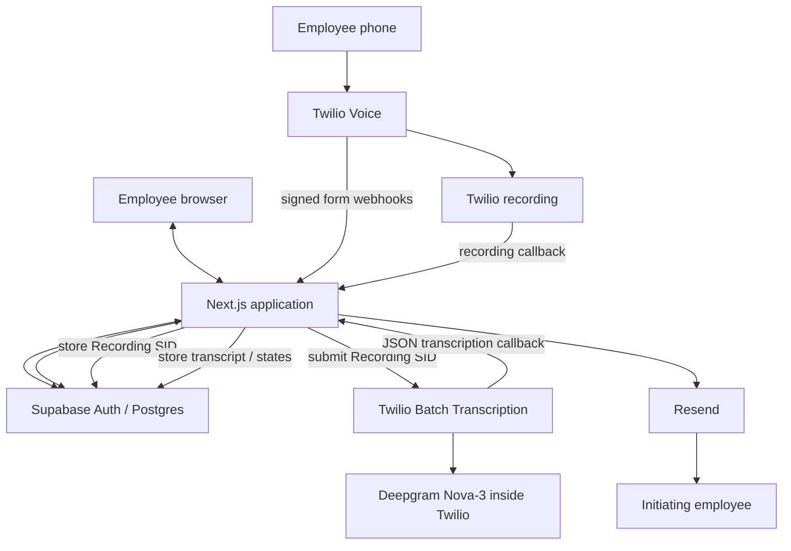
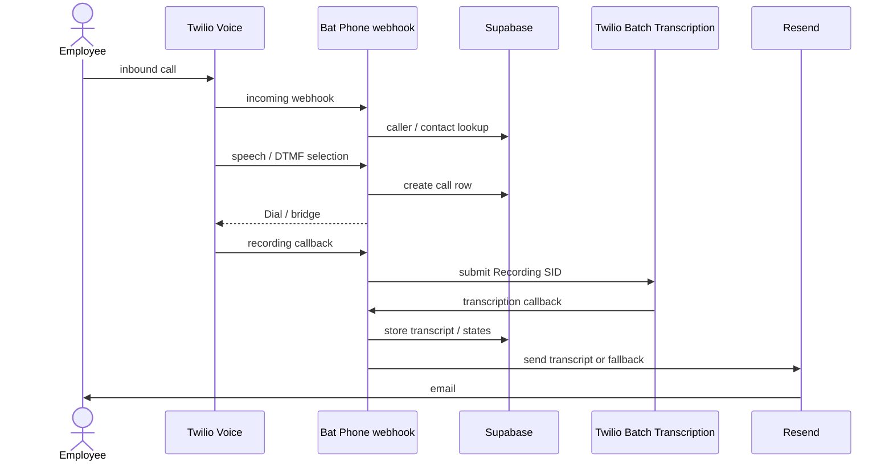

# Bat Phone Architecture

- [Bat Phone Architecture](#bat-phone-architecture)
  - [1. System overview](#1-system-overview)
  - [2. Technology choices](#2-technology-choices)
  - [3. Architecture diagram](#3-architecture-diagram)
  - [4. User / browser flow](#4-user--browser-flow)
  - [5. Voice call flow](#5-voice-call-flow)
  - [6. Post-call pipeline](#6-post-call-pipeline)
  - [7. Data model](#7-data-model)
  - [8. Security boundaries](#8-security-boundaries)
    - [Browser / user trust boundary](#browser--user-trust-boundary)
    - [Twilio webhook trust boundary](#twilio-webhook-trust-boundary)
    - [Server-only credential boundary](#server-only-credential-boundary)
  - [9. Reliability / idempotency](#9-reliability--idempotency)
  - [10. API / integration surface](#10-api--integration-surface)
  - [11. Important tradeoffs / POC boundaries](#11-important-tradeoffs--poc-boundaries)
  - [12. Scaling approach](#12-scaling-approach)
  - [13. Known Limitations](#13-known-limitations)
  - [14. Future Considerations](#14-future-considerations)
  - [15. Endpoints and key files](#15-endpoints-and-key-files)
    - [HTTP routes](#http-routes)
    - [Browser pages](#browser-pages)
    - [Server Actions](#server-actions)
    - [Key implementation files](#key-implementation-files)

## 1. System overview

Bat Phone is an internal employee calling tool. An authenticated employee manages contacts in the browser, calls into a Twilio number from their own phone, speaks or keys in the contact they want, and is bridged to that destination. Bat Phone stores the call record in Supabase, proxies recording playback back to the authenticated owner, submits completed recordings to Twilio Batch Transcription, and emails the initiating employee a transcript or fallback notification when post-call processing finishes.

## 2. Technology choices

| Technology | Controls |
| --- | --- |
| Next.js 16 App Router, React 19, TypeScript | Browser UI and server-side integration. Pages, Server Actions, and webhook handlers live in one application |
| Supabase Auth and Postgres | Employee identity, session management, and application data. RLS keeps browser-originated reads and writes owner-scoped |
| Twilio Programmable Voice | The phone number, TwiML execution, call bridging, and webhook delivery |
| Twilio Batch Transcription | Asynchronous recording transcription. Bat Phone submits Twilio `RecordingSid` values and receives a later JSON callback when the job completes or fails |
| Resend | The post-call transcript or fallback email to the initiating employee |
| Vercel | Production hosting |
| GitHub Codespaces | The reproducible cloud development environment documented in the repo |

## 3. Architecture diagram

End-to-end call sequence:

## 4. User / browser flow

The browser experience starts in `src/app/account/page.tsx`. Unauthenticated users land on the account screen and begin Google sign-in through Supabase Auth. The OAuth callback is handled in `src/app/auth/callback/route.ts`, which exchanges the code for a Supabase session, restricts any `next` return path to safe internal routes, and then sends the user either to onboarding or to the main application.

Onboarding in `src/app/onboarding/page.tsx` and `src/app/onboarding/actions.ts` captures the employee's own calling number in `public.profiles.phone_number`. That number is later used to identify the caller when Twilio hits the voice webhook.

After sign-in and onboarding, the main browser destinations are:

- `/contacts`: contact CRUD UI backed by authenticated Server Actions in `src/app/contacts/actions.ts`
- `/calls`: call history for the current user
- `/calls/[id]`: call detail view, including recording playback and transcript state
- `/account`: signed-in profile view, email display, and calling-number maintenance

The pages themselves are Server Components. They read the current Supabase session from the cookie-backed server client, rely on RLS plus explicit owner filters for user data, and hand interactive form behavior to client components where needed.

## 5. Voice call flow

The voice path starts when an employee calls the configured Twilio number.

1. Twilio sends a signed form POST to `/api/twilio/incoming`.
2. Bat Phone validates `X-Twilio-Signature` against the exact externally visible request URL, including proxy-forwarded host/protocol when present.
3. `incomingCallTwiml()` looks up the caller's `public.profiles.phone_number` and rejects unknown numbers.
4. If the caller is known and has contacts, Bat Phone returns a `<Gather>` prompt that accepts both speech and a single DTMF digit.
5. Twilio posts the gather result to `/api/twilio/resolve-contact`.
6. `resolveContactTwiml()` deterministically resolves the contact:
   - exact name match first
   - then case-insensitive name match
   - then constrained fuzzy matching
   - or DTMF `1` through `9` for the first contacts in the menu
7. On a match, Bat Phone creates the `calls` row before dialing and uses `twilio_call_sid` as the idempotency key so retried callbacks do not create duplicate calls.
8. Bat Phone returns `<Dial>` with `answerOnBridge`, the configured Bat Phone caller ID, dual-channel recording, `/api/twilio/dial-complete` as the dial action callback, and `/api/twilio/recording` as the recording status callback.
9. Twilio bridges the employee to the matched destination.
10. When the dial leg ends, Twilio posts `DialCallStatus` and duration to `/api/twilio/dial-complete`, which updates the stored status.

Error handling is intentionally simple and voice-safe: invalid signatures return `403`, malformed payloads return `400`, and unexpected repository or provider failures fall back to a generic TwiML message rather than exposing internal details to the caller.

## 6. Post-call pipeline

Once Twilio finishes the call recording, Bat Phone transitions into the asynchronous post-call path.

1. Twilio sends a signed form POST to `/api/twilio/recording`.
2. Bat Phone validates the signature, accepts only `RecordingStatus=completed`, and persists the `RecordingSid`, Twilio recording URL, and final recording duration to the `calls` row keyed by `twilio_call_sid`.
3. Bat Phone finds the same call again by `recording_sid`.
4. `submitRecordingForTranscription()` atomically claims transcription work by updating only rows whose `transcription_id` and `transcription_status` are still null.
5. Bat Phone submits the `RecordingSid` to Twilio Batch Transcription using the configured `TWILIO_TRANSCRIPTION_CONFIGURATION_ID`.
6. Twilio later POSTs an asynchronous JSON callback to `/api/twilio/transcription`.
7. Bat Phone validates both the Twilio signature and the unmodified raw JSON body. That validation depends on Twilio's `bodySHA256` request format, so the handler validates the raw body before parsing JSON.
8. The callback payload's `sourceId` is the original `recording_sid`, which Bat Phone uses to correlate the transcription result back to the call.
9. On success, Bat Phone converts Twilio's sentence list into a readable transcript and stores it in Supabase. On failure or unusable sentence data, the call is marked as transcription failed.
10. Bat Phone atomically claims email delivery, resolves the initiating employee's email, sends the transcript or fallback message through Resend, and links the email back to `/calls/[id]`.

Deepgram is not called directly by this application. The only transcription API call Bat Phone makes is the Twilio Batch Transcription job submission.

## 7. Data model

The current application data model centers on four tables:

- `auth.users`: Supabase-managed authentication users
- `public.profiles`: one row per authenticated user
- `public.contacts`: owner-scoped contacts that can be dialed
- `public.calls`: owner-scoped call history, recording metadata, transcription state, and email state

Important model relationships and fields:

- `public.profiles.id` equals `auth.users.id`. A trigger inserts the profile row when a new auth user is created.
- `public.profiles.phone_number` stores the employee's own calling number in `+1XXXXXXXXXX` format. The Twilio voice flow uses this field to identify which employee is calling in.
- Caller phone uniqueness is relied on operationally for routing: the voice flow assumes an inbound `From` number maps to one profile.
- `public.contacts.user_id` and `public.calls.user_id` define ownership. Browser-side queries pair RLS with explicit `.eq("user_id", user.id)` filters.
- `public.calls.contact_id` can be nulled if a contact is later deleted, so `contact_name_snapshot` preserves the historical name that was actually dialed.
- `public.calls.twilio_call_sid` is unique and is the idempotency anchor for the voice call record.
- `public.calls.recording_sid` uniquely correlates Twilio's recording callback and transcription callback back to the stored call.
- `public.calls.transcription_id` stores the Twilio Batch Transcription job ID.
- `public.calls.transcription_status`, `transcription_attempts`, `email_status`, `email_attempts`, and `email_sent_at` track post-call processing state and retries.

## 8. Security boundaries

### Browser / user trust boundary

- Employees authenticate through Google OAuth via Supabase Auth.
- The browser uses Supabase's publishable key and the authenticated session cookie, not the service-role key.
- RLS is enabled on `profiles`, `contacts`, and `calls`, and browser-originated queries stay owner-scoped.
- Contact and profile mutations use authenticated Next.js Server Actions rather than exposing a public CRUD API.
- OAuth return paths are restricted to safe internal paths so the sign-in flow cannot be turned into an open redirect.
- Missing and non-owned calls intentionally produce the same not-found behavior.

### Twilio webhook trust boundary

- Every Twilio form callback validates `X-Twilio-Signature`.
- Validation uses the externally visible URL because deployed requests may arrive through forwarded host/protocol headers.
- The transcription callback validates the raw JSON body, not a parsed object, because Twilio signs the exact body content.
- Invalid signatures are rejected before repository work begins.

### Server-only credential boundary

- `SUPABASE_SECRET_KEY`, `TWILIO_AUTH_TOKEN`, `TWILIO_ACCOUNT_SID`, and `RESEND_API_KEY` are server-only.
- Twilio callback handlers and recording fetches use the Supabase service-role client because Twilio is not acting as a signed-in browser user and still needs trusted database access.
- The browser never receives raw Twilio credentials, recording URLs, or Twilio media endpoints directly.
- Recording playback is proxied through `/api/calls/[callId]/recording` after authentication and ownership checks.

## 9. Reliability / idempotency

- Call rows are created before dialing so later dial-complete and recording callbacks have a durable record to update.
- `twilio_call_sid` is unique, and `createCallBeforeDial()` uses an idempotent insert/read pattern so duplicate delivery does not create duplicate call records.
- `recording_sid` is unique and is the correlation point for recording and transcription callbacks.
- `claimTranscription()` is atomic: only an unclaimed call can transition from null transcription state to `pending`.
- `claimEmail()` is atomic: only an unsent call can transition from null email state to `pending`.
- Both transcription submission and email delivery attempt a bounded retry loop before ending in a failed state.
- Duplicate callbacks are tolerated by checking the stored state before resubmitting work or re-sending email.
- Provider failures degrade to stored failed states plus fallback email behavior, rather than crashing the user-facing browser paths.

## 10. API / integration surface

| Method | Route | Purpose | Caller / auth |
| --- | --- | --- | --- |
| `POST` | `/api/twilio/incoming` | Start the TwiML voice flow for an inbound call | Twilio form webhook with `X-Twilio-Signature` |
| `POST` | `/api/twilio/resolve-contact` | Resolve speech or DTMF input to a contact and return `<Dial>` or retry/hangup TwiML | Twilio form webhook with `X-Twilio-Signature` |
| `POST` | `/api/twilio/dial-complete` | Persist the final dial outcome and duration | Twilio form webhook with `X-Twilio-Signature` |
| `POST` | `/api/twilio/recording` | Persist recording metadata and trigger transcription submission | Twilio form webhook with `X-Twilio-Signature` |
| `POST` | `/api/twilio/transcription` | Validate the raw JSON callback, correlate `sourceId`, store transcript state, and send email | Twilio JSON webhook with signature and raw-body validation |
| `GET` | `/api/calls/[callId]/recording` | Proxy the call recording back to the authenticated owner | Signed-in browser user, Supabase session, owner check |

Contact, profile, and call mutations are not exposed as REST endpoints. They currently live in authenticated Next.js Server Actions under `src/app/contacts/actions.ts`, `src/app/onboarding/actions.ts`, and `src/app/calls/actions.ts`.

An OpenAPI contract is not necessary yet because these routes are currently consumed only by Twilio and the first-party Bat Phone UI. It would become more valuable if independent services or third-party clients started consuming the same APIs.

## 11. Important tradeoffs / POC boundaries

**One Next.js application for the POC.** I kept the UI, Server Actions, and provider callbacks in a single Next.js app so auth, TwiML, and post-call writes share one deployable and one session boundary. I would split only if webhook reliability, deploy cadence, or team ownership diverged from the browser product.

**Deterministic contact resolution over an LLM.** I chose exact match, then case-insensitive match, then constrained fuzzy matching, plus DTMF `1` through `9`, because inbound routing has to be predictable and explainable. An LLM would add latency, cost, and misdial risk on a voice path that cannot ask the caller to debug a model. I would revisit this if a larger contact set started defeating rules-based matching, or if callers needed to resolve ambiguous phrases rather than names.

**Batch transcription instead of realtime transcription.** I submit the Twilio `RecordingSid` after the recording completes so the live call stays a gather-and-dial TwiML flow. I would move to realtime transcription if the employee needed live captions or in-call assistance.

**Native browser audio for recording playback.** I proxy the recording and let the platform audio control play it. A custom player would be worth the complexity only if we needed consistent chrome, waveforms, or clip-level controls across browsers.

**Navigation and refresh for call status, not live push.** History and detail pages read persisted Supabase state on render. That is enough while post-call work finishes after the call and the dataset stays small. I would add polling or realtime subscriptions if operators needed to watch transcription or email progress without leaving the page.

**Retries in the webhook path instead of a worker queue.** Bounded transcription and email retries run in the request that received the callback. That is the smallest design that still claims work atomically. I would extract a durable queue when webhook lifetime, isolated retries, or lost-callback reconciliation became operational requirements.

## 12. Scaling approach

I would keep the current Next.js modular monolith first. Pages, Server Actions, Twilio handlers, and Resend already live in separate modules inside one application. A rising user count by itself is not a reason to split services: the expensive work is per-call provider I/O, not a shared in-process bottleneck that a second repo would fix.

The first extraction I would make is asynchronous post-call processing. Recording persistence, transcription submission, transcription callbacks, and email currently share the webhook request lifetime. A durable queue plus a worker tier would let the Twilio handlers persist state and acknowledge quickly, retry independently of HTTP timeouts, and later support reconciliation for lost callbacks. I would do that when transcription or email work starts failing because of execution limits, or when retries need to survive a crashed request.

Telephony and webhook handling is the next natural boundary, but only if deployment, reliability, or team ownership diverge from the employee UI. Voice already has a different trust model (Twilio signatures, service-role writes) than the browser. I would split that surface if it needed its own region, SLA, or on-call owner. Until then, one deployable keeps signature validation, TwiML, and persistence in one place.

I would add cursor-based call-history pagination when an employee's `calls` list is large enough that an unbounded select and render becomes slow. The current POC dataset does not justify it.

I would add stronger observability — request tracing around `twilio_call_sid` / `recording_sid`, plus provider metrics for webhook latency, transcription job duration, and Resend success or failure — when someone is operating this in production and needs to diagnose a failed call without reading application logs by hand.

I would scale Supabase/Postgres and Vercel from measured concurrency and load: inbound webhook bursts, recording-proxy bandwidth, and database connection count. I would not pick an arbitrary user ceiling in advance.

Any later service boundary should keep the current idempotency and correlation IDs. `twilio_call_sid` remains the call-row key, `recording_sid` remains the recording/transcription correlation key, and transcription/email claims stay atomic so duplicate Twilio delivery remains safe after a split.

## 13. Known Limitations

These are deliberate POC boundaries, not unfinished product work:

1. Call history has no pagination
2. UI status updates appear on navigation or refresh rather than realtime push
3. Twilio Batch Transcription is asynchronous and currently a provider beta dependency
4. Transcription and email retries happen in the request processing path rather than a durable background worker
5. If an expected provider callback is permanently lost, there is no reconciliation worker today

## 14. Future Considerations

1. Add notifications when recording is saved and transcription is done
2. Next.js was used for this POC and should be able to handle a fairly large load of users, however, depending on the full scope of the project and its main intended use, we can consider having a separate back end that includes a microservice architecture. Again, this is dependent on unknowns at the moment and can be considered in the future.
3. Similarly we are using Twilio built-in tools for speech to text which works fine, but we can revisit once we start getting more load.

## 15. Endpoints and key files

### HTTP routes

| Method | Route | File | Caller |
| --- | --- | --- | --- |
| `GET` | `/auth/callback` | `src/app/auth/callback/route.ts` | Supabase Google OAuth redirect |
| `POST` | `/api/twilio/incoming` | `src/app/api/twilio/incoming/route.ts` | Twilio Voice webhook |
| `POST` | `/api/twilio/resolve-contact` | `src/app/api/twilio/resolve-contact/route.ts` | Twilio `<Gather>` action |
| `POST` | `/api/twilio/dial-complete` | `src/app/api/twilio/dial-complete/route.ts` | Twilio `<Dial>` action |
| `POST` | `/api/twilio/recording` | `src/app/api/twilio/recording/route.ts` | Twilio recording status callback |
| `POST` | `/api/twilio/transcription` | `src/app/api/twilio/transcription/route.ts` | Twilio Batch Transcription JSON callback |
| `GET` | `/api/calls/[callId]/recording` | `src/app/api/calls/[callId]/recording/route.ts` | Signed-in browser, recording playback |

### Browser pages

| Route | File | Purpose |
| --- | --- | --- |
| `/` | `src/app/page.tsx` | Redirects to `/contacts` |
| `/account` | `src/app/account/page.tsx` | Sign-in entry and signed-in profile |
| `/onboarding` | `src/app/onboarding/page.tsx` | First-time caller phone capture |
| `/contacts` | `src/app/contacts/page.tsx` | Contact list and CRUD |
| `/calls` | `src/app/calls/page.tsx` | Call history |
| `/calls/[id]` | `src/app/calls/[id]/page.tsx` | Call detail, recording, transcript |

### Server Actions

Contact and profile writes are not REST endpoints. They live in authenticated Server Actions:

| Action | File | Purpose |
| --- | --- | --- |
| `createContact`, `updateContact`, `deleteContact` | `src/app/contacts/actions.ts` | Contact CRUD |
| `saveProfilePhone` | `src/app/onboarding/actions.ts` | Onboarding and account caller-number save |
| `deleteCall` | `src/app/calls/actions.ts` | Owner-scoped call delete |

### Key implementation files

| File | Owns |
| --- | --- |
| `src/proxy.ts` | Auth guard for `/contacts`, `/calls`, and `/onboarding` |
| `src/lib/twilio/voice-flow.ts` | TwiML for inbound, gather, dial, and failure paths |
| `src/lib/twilio/contact-matching.ts` | Deterministic name / DTMF matching |
| `src/lib/twilio/request-validation.ts` | Twilio signature and raw-body validation |
| `src/lib/twilio/call-idempotency.ts` | Create-before-dial keyed by `twilio_call_sid` |
| `src/lib/twilio/telephony-repository.ts` | Service-role writes for voice callbacks |
| `src/lib/twilio/batch-transcription.ts` | Transcription submit and callback handling |
| `src/lib/twilio/phase4-repository.ts` | Atomic transcription / email claims |
| `src/lib/twilio/recording-media.ts` | Server-side Twilio recording fetch |
| `src/lib/email/call-transcript.ts` | Resend transcript and fallback email |
| `src/lib/calls.ts` | Shared call record shape and display helpers |
| `src/utils/supabase/client.ts` | Browser Supabase client |
| `src/utils/supabase/server.ts` | Cookie / session Supabase client |
| `src/utils/supabase/admin.ts` | Service-role Supabase client |