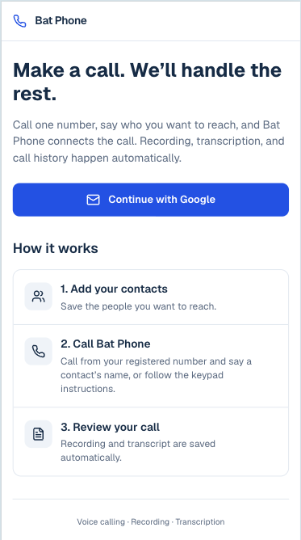
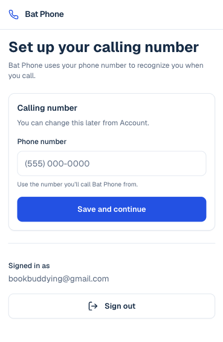
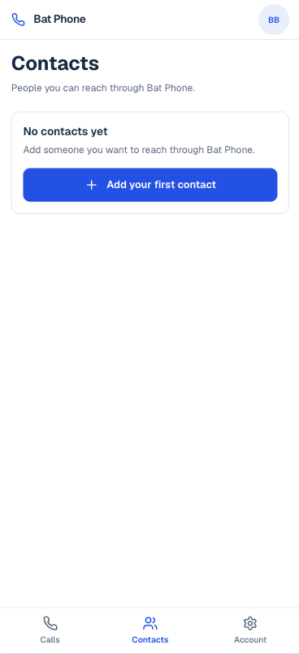
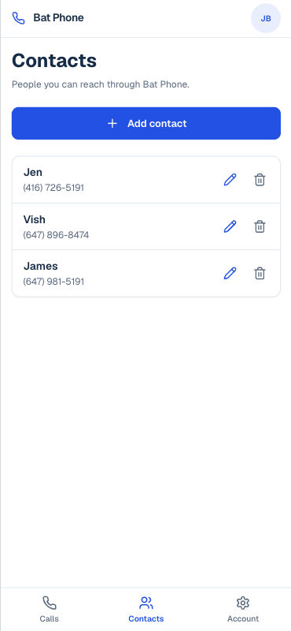
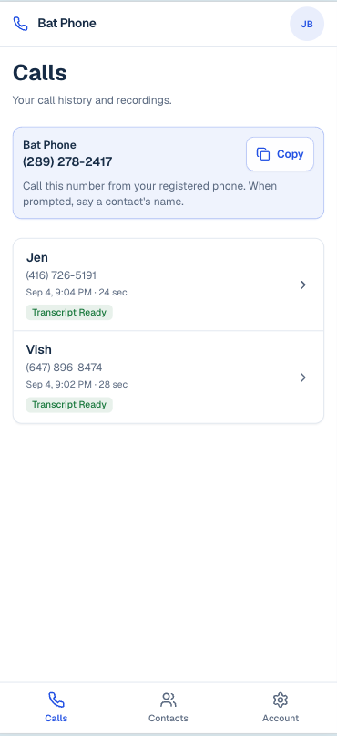
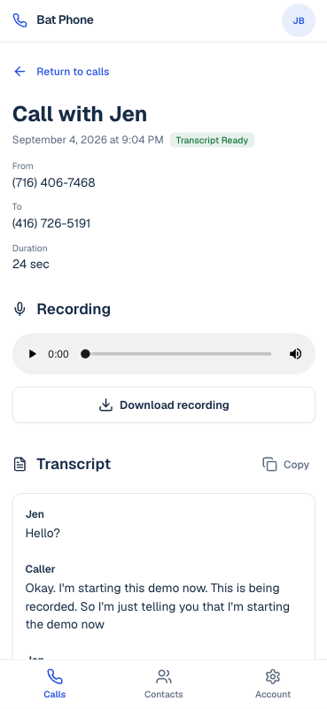
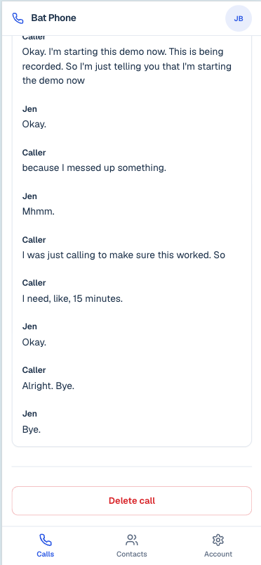

# Bat Phone — Quick Start Guide

Bat Phone lets you call saved contacts through one shared number. Calls are recorded automatically, transcribed after completion, and saved to your call history.

**Live app:** [https://genius-bat-phone.vercel.app](https://genius-bat-phone.vercel.app)

**PDF (internal, printable):** [QUICK_START_GUIDE.pdf](./QUICK_START_GUIDE.pdf) — regenerate with `npm run docs:quick-start-pdf` after screenshot or copy changes.

---

## 1. Sign in

1. Open Bat Phone in your browser.
2. On the landing page, choose **Continue with Google**.
3. Sign in with your work Google account when prompted.

---

## 2. Set up your calling number

After sign-in, you’ll be asked for your **calling number**.

- Enter the mobile or desk phone you will **actually dial from**.
- Bat Phone uses this number to **recognize you** when you call.
- You can change it later from **Account**.

Tap **Save and continue** when the number is correct.

---

## 3. Add a contact

If you don’t have any contacts yet, Bat Phone sends you to **Contacts**.

1. Tap **Add contact** (or **Add your first contact**).
2. Enter the person’s **name** and **phone number** (the number Bat Phone will connect you to).
3. Save the contact.

Repeat for anyone you want to reach through Bat Phone.

---

## 4. Make a call

Once you have at least one contact, **Calls** is your usual home screen.

1. Open **Calls** from the bottom navigation (first tab).
2. In the Bat Phone card at the top, note the number **(289) 278-2417** and tap **Copy** if you want it on your clipboard.
3. From your **registered phone** (the **Calling number** in Account), dial that number.
4. Follow the on-screen guidance:

   > Call this number from your registered phone. When prompted, say a contact's name, or follow the keypad instructions.

Bat Phone connects you to that contact. When the call ends, recording and transcription are handled automatically.

---

## 5. Review your calls

Open **Calls** to see your history.

Each row shows:

- Contact name (or the name captured on the call)
- Date and time
- Duration
- Status when it matters — for example **Transcript Ready** after a connected call, or **No answer** if the contact did not pick up

Tap a call to open its detail page. Unsuccessful attempts still appear in history; the detail page explains that recording and transcript apply when the contact answers.

---

## 6. Recording and transcript

Tap a call in **Calls**, or use **Return to calls** from detail to go back to the list.

On the call detail page you can:

- **Play** the recording (audio controls under **Recording**)
- Tap **Download recording**
- **Read** the transcript under **Transcript** when status shows **Transcript Ready**
- Tap **Copy** next to **Transcript** to copy the full text

Transcripts may take a short time to appear after the call ends.

---

## Troubleshooting

### Bat Phone does not recognize me

Call from the **Calling number** shown in **Account**. If you changed phones, update that number in Account first.

### A contact is not recognized

Say the contact’s name clearly again, or use the keypad instructions during the call. Check that the contact exists under **Contacts** with the name you’re saying.

### Transcript is not ready

Transcription runs after the call ends and may take a short time. Refresh **Calls** or reopen the call detail page later.

### I need to change my calling number

Open **Account**, edit **Calling number**, and save. Future calls must come from the updated number.

### A call stays on “Calling” in the app

The contact leg may still be ringing, or Bat Phone may not have received the final result from Twilio yet. Refresh **Calls** after the call ends. If the status never updates, your administrator should confirm Twilio webhooks to `/api/twilio/dial-complete` are succeeding (HTTP 200).

---

## Appendix: Demo script (presenters)

Use this once before a live demo, then walk through it on stage.

**Pre-flight (no app deploy required):**

1. In Twilio **Debugger**, confirm recent voice webhooks to `/api/twilio/dial-complete` return **200**.
2. From your **registered** phone, call Bat Phone, name a consenting contact who will **not answer**, and let the call finish.
3. In **Calls**, confirm a new row with that contact’s name and a **No answer** badge; open it and confirm there is no recording or transcript.

**On stage:**

1. Show **Calls** and a completed call (recording + transcript) if you have one.
2. Place a Bat Phone call to a contact who agrees not to answer (or replay the pre-flight row).
3. On the phone, note the spoken message that the contact did not answer.
4. Open **Calls** → tap the attempt → point out the **No answer** badge and the short explanation under the title; recording and transcript sections state nothing was captured.

Busy, failed, and canceled attempts behave the same way in history with matching status badges.

---

## Where to get help

- **Account** — your Google identity, calling number, and activity summary.
- **Contacts** — add, edit, or remove people you can reach through Bat Phone.

For technical or access issues, contact your Bat Phone administrator.
